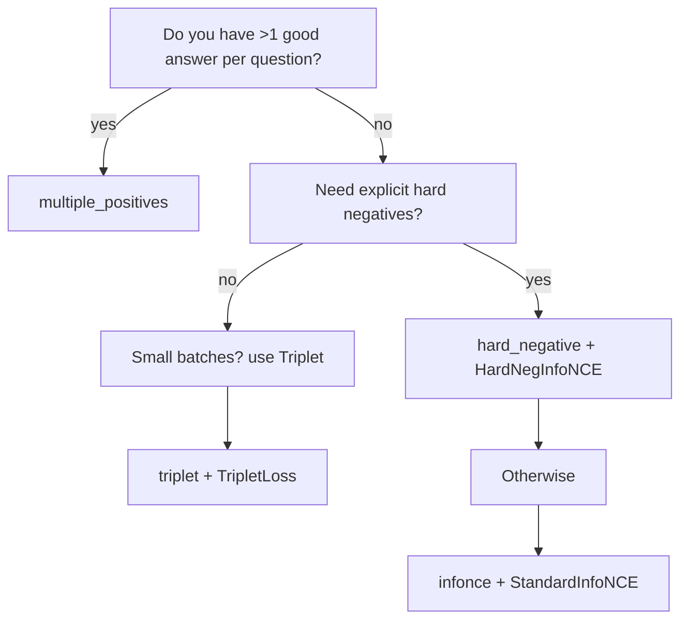

# QA Embeddings Loss Comparison

A system to compare different loss functions for embedding models on question-answer retrieval tasks.

## Overview

This project compares how different loss functions perform when training embedding models for retrieving relevant answers to questions. The project uses StackExchange data to train models on real-world question-answer pairs with upvote-based relevance scores.

## Features

- Flexible dataset with configurable batch transformations:
  - InfoNCE with in-batch negatives
  - Multiple positives per question
  - Hard negative sampling
  - Triplet format
  - Listwise ranking format
- Comprehensive loss function implementations:
  - Standard InfoNCE (with temperature scaling)
  - Rank-weighted InfoNCE
  - Hard negative InfoNCE
  - Multiple positives loss
  - Triplet loss
  - Listwise ranking loss
- Standardized evaluation metrics:
  - MRR (Mean Reciprocal Rank)
  - NDCG@k (Normalized Discounted Cumulative Gain)
  - MAP@k (Mean Average Precision)
  - Hard negative accuracy
- Modular architecture for easy extension and experimentation
- Integration with Weights & Biases for experiment tracking
- Hardware acceleration detection (MPS, CUDA, CPU)

## Getting Started

### Prerequisites

- Python 3.8+
- [uv](https://github.com/astral-sh/uv) (Python package management)
- Kaggle API credentials (for dataset download)

### Installation

Clone the repository and install dependencies:

```bash
git clone https://github.com/yourusername/qa-embeddings-loss-comparison.git
cd qa-embeddings-loss-comparison
uv pip install -e .
```

### Running Experiments

To train a model with a predefined configuration:

```bash
uv run rank-test --config configs/test.json
```

To create a custom configuration, you can copy and modify one of the existing configuration files in `configs/`.

## 🛰️  How a Sample Moves Through the System

```mermaid
graph LR
    subgraph Data‐Preparation
        A[Raw JSON QA<br/>(+ scores)] --> B[Batch Transform<br/>(e.g. infonce)]
    end
    B --> C[PyTorch DataLoader] --> D[Encoder (Model)] --> E[Loss Function] --> F[Metrics & Logging]
```

Shape convention: `N` = questions in the batch  
`M_q` = positives for question `q`  
`d` = embedding dimension (default 128)

| Transform | Returned keys (main) | Shapes |
|-----------|----------------------|--------|
| `infonce` | `q_input_ids`, `a_input_ids` | `(N, L)`, `(N, L)` |
| `multiple_positives` | `q_input_ids`, `a_input_ids`, `ranks`, `scores` | `(~N·M, L)` |
| `hard_negative` | *list* of dicts, each with `answers` list | variable |
| `triplet` | `q_input_ids`, `a_pos_input_ids`, `a_neg_input_ids` | `(N, L)` each |
| `listwise` | *list* of dicts (`a_input_ids` is `(≤max_answers, L)`) | variable |
| `standardized_test` | fixed evaluation format (see `transforms.standardized_test_transform`) | variable |

(L = token sequence length after padding/truncation.)

## 🔍  Detailed Sampling Strategies

<details>
<summary><strong>1. InfoNCE (`infonce_batch_transform`)</strong></summary>

**Intuition** – One positive per question, all other answers in the same mini-batch act as negatives (classic SimCLR / CLIP style).

```python
from rank_test.flexible_dataset import FlexibleQADataset, infonce_batch_transform
dataset = FlexibleQADataset(
    "data/ranked_qa.json",
    batch_transform_fn=infonce_batch_transform,
    batch_size=8,           # provides 7 in-batch negatives per sample
    take_top=True
)
batch = dataset[0]
print(batch.keys())
# dict_keys([... 'q_input_ids', 'a_input_ids', 'ranks', 'scores'])
```

Pros 👉 fastest, no extra memory.  
Cons 👉 treats other good answers from the *same* question as negatives (can be harmful).

Best paired with: `StandardInfoNCELoss`, `RankInfoNCELoss`.
</details>

<details>
<summary><strong>2. Multiple Positives (`multiple_positives_batch_transform`)</strong></summary>

Creates **M duplicates** of each question – one for each high-scoring answer.

```
Q           A⁺₁
└──copy──►  A⁺₂
            …
```

Returned batch length ≈ `Σ_q M_q`.

Useful when you have several "correct" answers and want the model to learn *relative* quality (rank/score).  
Pairs naturally with `RankInfoNCELoss` "rank" or "score" flavours and `MultiplePositivesLoss`.
</details>

<details>
<summary><strong>3. Hard Negative (`hard_negative_batch_transform`)</strong></summary>

Each item contains one question and **all** of its answers (top answer + hard negatives).  
The loss can explicitly penalise high similarity between the question and the *wrong* answers of the same question.

```python
item = batch_items[0]
item.keys()          # ['q_input_ids', 'answers', 'question_id', ...]
len(item['answers']) # e.g. 5
```

Combine with `HardNegativeInfoNCELoss`.
</details>

<details>
<summary><strong>4. Triplet (`triplet_batch_transform`)</strong></summary>

Outputs three tensors per sample (query, positive, negative).  
Negative can be "hard" (same question) or "in-batch" (different question) depending on `neg_strategy`.

Pairs with `TripletLoss (margin)`.
</details>

<details>
<summary><strong>5. Listwise (`listwise_batch_transform`)</strong></summary>

Delivers **a list of answers per query** (≤ `max_answers`) plus their normalised scores → enables true listwise ranking losses.

Pairs with `ListwiseRankingLoss`.
</details>

<details>
<summary><strong>6. Standardised Test (`standardized_test_transform`)</strong></summary>

Evaluation-only transform that guarantees every question has:
* 1 positive (top answer)  
* up to 5 hard negatives (lower-ranked answers)  
* normal negatives (top answers from other questions)

Used automatically by `evaluate.py`.
</details>

## 🔢  Detailed Loss Functions

| Loss | Formula (sketch) | Typical Inputs | Notes |
|------|------------------|----------------|-------|
| **StandardInfoNCELoss** | \(L=-\frac12\bigl[\log\frac{e^{s_{qq^+}/\tau}}{\sum_a e^{s_{qa}/\tau}}+\log\frac{e^{s_{aa^+}/\tau}}{\sum_q e^{s_{aq}/\tau}}\bigr]\) | `(N,d)` × `(N,d)` | Symmetric InfoNCE. |
| **RankInfoNCELoss** | Same as above but multiplies individual similarities by rank / score weights. | needs `question_ids`, optionally `ranks`/`scores`. | `use_ranks` or `use_scores`. |
| **HardNegativeInfoNCELoss** | \(L=L_{InfoNCE}+ \lambda\; \frac1{|H|}\sum_{(q,a^-)} e^{s_{qa^-}/\tau}\) | same as standard + `question_ids` | Penalises hard-neg pairs. |
| **MultiplePositivesLoss** | Normalised log-softmax where *all* answers of a question are positives. | batch from `multiple_positives` | Optional rank weighting. |
| **TripletLoss** | \(\max(0,\; s_{q,a^-}-s_{q,a^+}+m)\) | `(N,d)` triplets | Margin `m` default 0.3. |
| **ListwiseRankingLoss** | KL-divergence between softmax(sim) and softmax(scores) | listwise batch |  Temperature controls softmax sharpness. |

Example:

```python
loss_fn = RankInfoNCELoss(temperature=0.07, use_scores=True, score_weight=0.05)
loss, metrics = loss_fn(
    q_embeddings, a_embeddings,
    question_ids=batch['question_ids'],
    scores=batch['scores']
)
```

## ⚡ Quick-start Compatibility Matrix

| Transform ↓ / Loss → | InfoNCE | Rank-InfoNCE | Hard-Neg-InfoNCE | Mult-Pos | Triplet | Listwise |
|----------------------|:-------:|:------------:|:----------------:|:--------:|:-------:|:--------:|
| `infonce` | ✔ | ✔ | ✖ | ✖ | ✖ | ✖ |
| `multiple_positives` | ✔ | ✔ | ✖ | ✔ | ✖ | ✖ |
| `hard_negative` | ✖ | ✖ | ✔ | ✖ | ✖ | ✖ |
| `triplet` | ✖ | ✖ | ✖ | ✖ | ✔ | ✖ |
| `listwise` | ✖ | ✖ | ✖ | ✖ | ✖ | ✔ |
| `standardized_test` | eval-only | eval-only | eval-only | eval-only | eval-only | eval-only |

## 🧭 Choosing the Right Combo



## 🎬  Minimal End-to-End Example

```python
uv add torch transformers
uv run examples/flexible_dataset_demo.py --data-path data/sample_qa.json
```

Outputs (truncated):

```
InfoNCE Dataset and Loss
Created InfoNCE dataset with 1 batches
Loss: 2.1037
Metrics: {'loss': 2.10, 'q2a_acc': 0.25, ...}
```

Feel free to explore different flags (`--help`) to switch strategies and losses.

## Batch Transformation Strategies

The system uses a flexible data processing approach with various batch transformation strategies:

| Strategy | Description | Best Used With |
|----------|-------------|----------------|
| `infonce` | Standard InfoNCE format with each question paired with a top answer | StandardInfoNCELoss, RankInfoNCELoss |
| `multiple_positives` | Each question appears multiple times with different positive answers | MultiplePositivesLoss |
| `hard_negative` | Explicitly includes lower-ranked answers as hard negatives | HardNegativeInfoNCELoss |
| `triplet` | Creates triplets of (query, positive answer, negative answer) | TripletLoss |
| `listwise` | Prepares multiple ranked answers per question for listwise ranking | ListwiseRankingLoss |
| `standardized_test` | Standard evaluation format for fair comparison | Used automatically for evaluation |

Each transformation prepares data in a specific format suitable for its corresponding loss function. The transforms can be configured with additional parameters:

- `take_top`: Whether to use the highest-ranked answer (True) or a random answer (False)
- `pos_count`: Maximum number of positive answers to include per question
- `neg_strategy`: Strategy for selecting negatives in triplet format ("hard_negative", "in_batch", "mixed")
- `max_answers`: Maximum number of answers to include per question in listwise format

## Loss Functions

### StandardInfoNCELoss

Standard InfoNCE contrastive loss that contrasts positive pairs against in-batch negatives.

**Parameters:**
- `temperature`: Temperature parameter for scaling similarity scores (default: 0.1)

### RankInfoNCELoss

InfoNCE loss that leverages rank or score information from the dataset.

**Parameters:**
- `temperature`: Temperature parameter for scaling similarity scores (default: 0.1)
- `use_ranks`: Whether to use ordinal rank information (default: True)
- `use_scores`: Whether to use cardinal score information (default: False)
- `rank_weight`: Weight for rank-based penalties (default: 0.1)
- `score_weight`: Weight for score-based adjustments (default: 0.01)

### HardNegativeInfoNCELoss

InfoNCE loss with additional penalty for hard negatives.

**Parameters:**
- `temperature`: Temperature parameter for scaling similarity scores (default: 0.1)
- `hard_negative_weight`: Weight for the hard negative component (default: 1.0)

### MultiplePositivesLoss

Loss function that handles multiple positive answers per question.

**Parameters:**
- `temperature`: Temperature parameter for scaling similarity scores (default: 0.1)
- `rank_weight`: Weight for rank-based penalties (default: 0.1)

### TripletLoss

Triplet loss for query-positive-negative triplets.

**Parameters:**
- `margin`: Margin between positive and negative similarities (default: 0.3)

### ListwiseRankingLoss

Listwise ranking loss for learning to rank multiple answers.

**Parameters:**
- `temperature`: Temperature for scaling similarities (default: 1.0)

## Configuration Options

The system uses a strong typing configuration system based on Pydantic. Key configuration options include:

**Dataset and Data Processing:**
- `data_path`: Path to the JSON dataset with ranked QA pairs
- `limit`: Maximum number of questions to process
- `test_size`: Fraction of data to use for testing
- `seed`: Random seed for reproducibility
- `batch_size`: Batch size for training
- `dataset_strategy`: Dataset strategy to use (currently supports "flexible")
- `batch_transform`: Batch transformation strategy to use

**Model Architecture:**
- `embed_dim`: Embedding dimension for the base model
- `projection_dim`: Projection dimension for the final embeddings

**Training Parameters:**
- `epochs`: Number of training epochs
- `learning_rate`: Learning rate for optimization
- `eval_steps`: Number of steps between evaluations
- `eval_at_zero`: Whether to evaluate before training
- `checkpoint_interval`: Number of epochs between checkpoints

**Loss Function Parameters:**
- `loss_type`: Type of loss function to use
- `temperature`: Temperature parameter for scaling similarity scores
- `margin`: Margin for triplet loss
- `use_ranks`: Whether to use rank information
- `use_scores`: Whether to use score information
- `rank_weight`: Weight for rank-based adjustments
- `score_weight`: Weight for score-based adjustments
- `hard_negative_weight`: Weight for hard negative penalty

**Output and Logging:**
- `output_dir`: Directory to save outputs
- `log_to_wandb`: Whether to log to Weights & Biases
- `wandb_project`: Weights & Biases project name

Example configuration:
```json
{
  "name": "Test",
  "data_path": "data/ranked_qa.json",
  "limit": 100,
  "test_size": 0.02,
  "seed": 42,
  "embed_dim": 768,
  "projection_dim": 128,
  "batch_size": 16,
  "epochs": 1,
  "learning_rate": 2e-5,
  "eval_steps": 50,
  "eval_at_zero": true,
  "debug": false,
  "output_dir": "models/flexible",
  "log_to_wandb": false,
  "dataset_strategy": "flexible",
  "batch_transform": "infonce",
  "pos_count": 3,
  "loss_type": "infonce",
  "temperature": 0.1,
  "use_ranks": true,
  "use_scores": false,
  "rank_weight": 0.1
}
```

## Evaluation Metrics

The system provides comprehensive evaluation metrics:

- **MRR**: Mean Reciprocal Rank - measures how highly the first relevant document is ranked
- **Accuracy@k**: Percentage of queries where a relevant document is ranked in the top k
- **NDCG@k**: Normalized Discounted Cumulative Gain - measures ranking quality considering the graded relevance of documents
- **MAP@k**: Mean Average Precision - measures precision at different recall levels
- **Hard Negative Accuracy**: Measures the model's ability to distinguish between positive answers and hard negative answers (lower-ranked answers to the same question)

## Project Structure

- `src/rank_test/`
  - `dataset.py`: Dataset class and data loading utilities
  - `transforms.py`: Batch transformation strategies
  - `models.py`: Model architecture definitions
  - `losses.py`: Loss function implementations
  - `train.py`: Training loop and utilities
  - `evaluate.py`: Evaluation metrics and utilities
  - `config.py`: Experiment configuration
  - `run_experiment.py`: Experiment runner for comparing multiple losses

## Contributing

Contributions are welcome! Please feel free to submit a Pull Request.

## License

This project is licensed under the MIT License - see the LICENSE file for details.